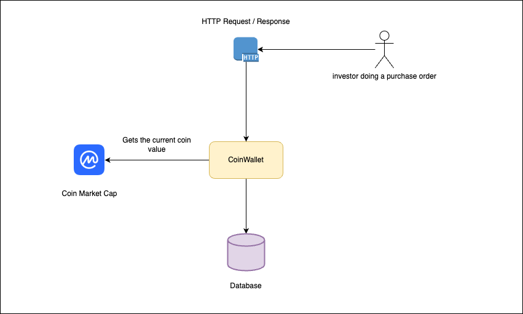

# Medium Onion-Architecture

This project is references a story on Medium Blog about [onion-architecture](https://medium.com/@andrelucastic/the-practical-onion-architecture-the-onion-that-doesnt-make-you-cry-f48e1b88355)

## Tech Stack

* JDK 17
* SpringBoot
* Maven
* Docker
* Docker compose
* PostgresSQL
* FlyWay

# Architecture Overview

# Design

[https://medium.com/@andrelucastic/the-practical-onion-architecture-the-onion-that-doesnt-make-you-cry-f48e1b88355](https://medium.com/@andrelucastic/the-practical-onion-architecture-the-onion-that-doesnt-make-you-cry-f48e1b88355)

